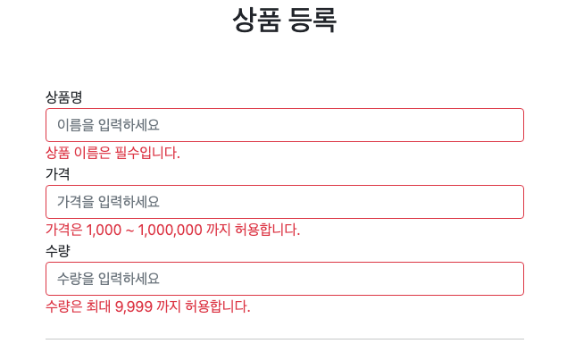
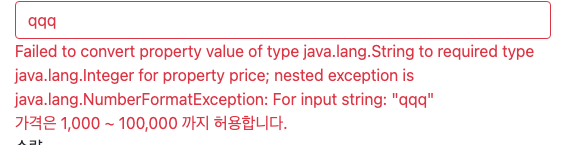
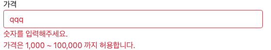

### 오류 코드와 메시지 처리

`FieldError`, `ObjectError`의 생성자는 `codes`,`argument`를 제공하는데, 이것은 오류 발생시 오류 코드로 메시지를 찾기 위해 사용된다.


**errors 메시지 파일 생성**

`messages.properties` 를 사용해도 되지만, 오류 메시지를 구분하기 쉽게 `errors.properties` 라는 별도의 파일로 관리해보자.


먼저 스프링 부트가 해당 메시지 파일을 인식할 수 있게 다음 설정을 추가한다. 이렇게하면`messages.properties` , `errors.properties` 두 파일을 모두 인식한다. (생략하면`messages.properties` 를 기본으로 인식한다.)


**스프링 부트 메시지 설정 추가**

`application.properties`
```properties
spring.messages.basename=messages,errors
```


`errors.properties`

```properties
required.item.itemName=상품 이름은 필수입니다.
range.item.price=가격은 {0} ~ {1} 까지 허용합니다.
max.item.quantity=수량은 최대 {0} 까지 허용합니다.
totalPriceMin= 가격 * 수량의 합은 {0}원 이상이어야 합니다. 현재 값 = {1}
```
여기서 errors.properties에서 설정해놓은 Key를 바탕으로 Value를 뽑아올 수 있다.

```java
if (!StringUtils.hasText(item.getItemName())) {
            bindingResult.addError(new FieldError("item","itemName",item.getItemName(),false, new String[]{"required.item.itemName"},null,null));
        }
        if (item.getPrice() == null || item.getPrice() < 1000 || item.getPrice() > 10000000) {
            bindingResult.addError(new FieldError("item","price",item.getPrice(),false, new String[]{"range.item.price"},new Object[]{1000,1000000},null));
        }
        if (item.getQuantity() == null || item.getQuantity() >= 9999) {
            bindingResult.addError(new FieldError("item","quantity", item.getQuantity(),false, new String[]{"max.item.quantity"},new Object[]{9999},null));
        }
        //Global Error
        if (item.getPrice() != null && item.getItemName() != null) {
            int totalPrice = item.getPrice( ) * item.getQuantity();
            if (totalPrice < 10000) {
                bindingResult.addError(new ObjectError("item",new String[]{"totalPriceMin"},new Object[]{10000,totalPrice},null));
            }
        }
```



**참고**: `errors_en.properties` 파일을 생성하면 오류 메시지도 국제화 처리를 할 수 있다.


### Spring이 만든 에러 처리하기

검증 오류 코드는 크게 두가지로 나눌 수 있다.
- `BindingResult`의  `rejectValue()`, errors.propertis를 통해 개발자가 정의한 에러메시지
- Spring이 만든 에러 메시지

앞선 내용에서 BindingResult를 이용하여 에러메시지를 정의해봤고, Spring이 만든 에러메시지를 재정의 해보도록 하겠다.

먼저 `price`필드에 문자를 넣어보겠다.



이러한 에러메시지가 나온다. 이는 `price`필드는 int 타입인데, 문자타입을 넣으니 `Convert`를 실패했다는 오류가 나온다. 쉽게 말해
타입 오류인 것이다. 이는 Spring이 만든 에러메시지인데 이를 재정의 해보겠다.


에러가 났을 경우 BindingResult가 이를 잡았을 테니 로그를 확인해보자.

```console
codes [typeMismatch.item.price,typeMismatch.price,typeMismatch.java.lang.Integer,typeMismatch];
```

이를 자세히 보면 다음과 같이 4가지 메시지 코드가 나온걸 확인할 수 있다.
- `typeMismatch.item.price`
- `typeMismatch.item.price`
- `typeMismatch.java.lang.Integer`
- `typeMismatch`

그리고 이미지에서 보였던 에러메시지는 해당 메시지의 defualtMessage가 출력된 것이다.
```console
default message [Failed to convert property value of type 'java.lang.String' to required type 'java.lang.Integer' for property 'price'; nested exception is java.lang.NumberFormatException: For input string: "qqqq"]
```

스프링은 타입 오류가 발생하면 `typeMismatch` 라는 오류 코드를 사용한다. 이 오류 코드가 `MessageCodesResolver` 를 통하면서 4가지 메시지 코드가 생성된 것이다.

아직 `errors.properties` 에 메시지 코드가 없기 때문에 스프링이 생성한 기본 메시지가 출력된 것이다. 이를 이용하여 `errors.properties`에 에러 코드를 재정의 할 수 있다.

`error.properties` 에 다음 내용을 추가하자.
```properties
#추가
typeMismatch.java.lang.Integer=숫자를 입력해주세요.
typeMismatch=타입 오류입니다.
```
그리고 실행해보면

이러한 결과가 나온다.

typeMismatch.java.lang.Integer=숫자를 입력해주세요. 해당 내용이 적용된거 같다. 이는 level3에 해당하는 에러 범위이다.


