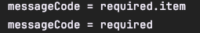
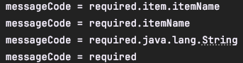

### MessageCodesResolver

우선순위가 존재하며, 규칙이 존재하는 **MessageCodesResolver**

- MessageCodesReslover는 검증 오류 코드로 메시지 코드를 생성한다.
- MessageCodesResolver 인터페이스이고, DefualtMessageCodesResolver는 기본 구현체이다.
- 주로 다음과 함께 사용 `ObjectError`,`fieldError`
```java
 public String[] resolveMessageCodes(String errorCode, String objectName) {
        return this.resolveMessageCodes(errorCode, objectName, "", (Class)null);
    }

    public String[] resolveMessageCodes(String errorCode, String objectName, String field, @Nullable Class<?> fieldType) {
        Set<String> codeList = new LinkedHashSet();
        List<String> fieldList = new ArrayList();
        this.buildFieldList(field, fieldList);
        this.addCodes(codeList, errorCode, objectName, fieldList);
        int dotIndex = field.lastIndexOf(46);
        if (dotIndex != -1) {
            this.buildFieldList(field.substring(dotIndex + 1), fieldList);
        }

        this.addCodes(codeList, errorCode, (String)null, fieldList);
        if (fieldType != null) {
            this.addCode(codeList, errorCode, (String)null, fieldType.getName());
        }

        this.addCode(codeList, errorCode, (String)null, (String)null);
        return StringUtils.toStringArray(codeList);
    }
```
resolveMessageCodes라는 메서드를 호출하면 반환타입이 String 배열이다.
즉 error 코드를 넣으면 여러개의 메시지가 나온다고 볼 수 있다.

```java
    @Test
    void messageCodesResolverObject() {
        String[] messageCodes = codesResolver.resolveMessageCodes("required", "item");
        for (String messageCode : messageCodes) {
            System.out.println("messageCode = " + messageCode);
        }
        Assertions.assertThat(codesResolver.resolveMessageCodes("required", "item")).isNotNull();
        Assertions.assertThat(messageCodes).containsExactly("required.item", "required");
    }

```

required.item, required 순으로 나온걸 볼 수 있다.(required로 error코드를 인자로 보냈을 때 우선순위가 좀더 세밀한 것부터 범용적인 것으로 나온걸 볼 수 있다.)

**DefaultMessageCodesResolver의 기본 메시지 생성 규칙**

**객체 오류**
객체 오류의 경우 다음 2가지 순서로 생성한다.

errorCode,ObjectName -> Test 코드에서 보면 errorCode는 `required`이고, ObjectName은 `item`이다.

결과를 보면 errorCods + " . " + objectName이 합쳐진걸 볼 수 있다.


**필드 오류**
```java
    @Test
    void messageCodesResolverField() {
        String[] messageCodes = codesResolver.resolveMessageCodes("required", "item", "itemName", String.class);
        Assertions.assertThat(messageCodes).isNotNull();
        Assertions.assertThat(messageCodes).containsExactly("required.item.itemName", "required.itemName", "required.java.lang.String","required");
    }
```
필드 오류의 경우 다음 4가지 순서로 메시지 코드를 생성한다.

errorCode + " . " + objectName + " . " + field

errorCode + " . " + field

errorCode + " . " + field type

errorCode




**MessageCodesResolver**의 동작방식
- `rejectValue()`,`reject()`는 내부에서 `MessageCodesResovler`를 사용한다. 여기에서 메시지 에러 코드들을 생성한다.(`objectError`,`fieldError`가 `rejectValue, rejcet`에 의해 사용된다.)
- `FieldError`, `ObjectError`의 생성자를 보면, 오류 코드를 하나가 아니라 여러 오류 코드를 가질 수 있는 걸 볼 수 있다.
- BindingResult의 로그를 통해서 확인해 보면, `codes [range.item.price, range.price, range.java.lang.Integer, range]` 라고 찍히는 걸 볼 수 있다.

**FieldError** `rejectValue("itemName", "required")`

다음 4가지 오류 코드를 자동으로 생성
- `required.item.itemName`
- `required.itemName`
- `required.java.lang.String`
- `required`


**ObjectError** `reject("totalPriceMin")`

다음 2가지 오류 코드를 자동으로 생성
- `totalPriceMin.item`
- `totalPriceMin`
