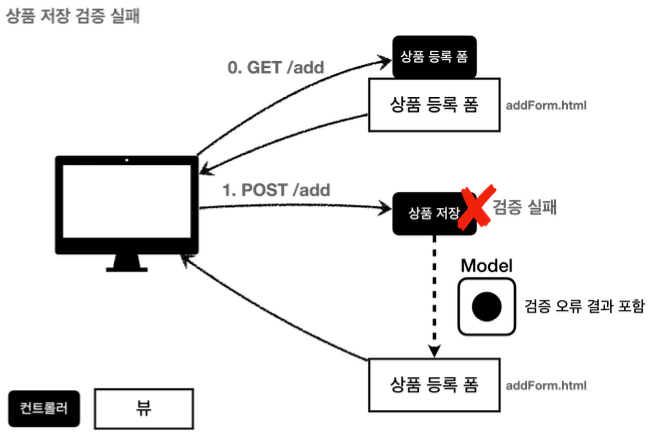
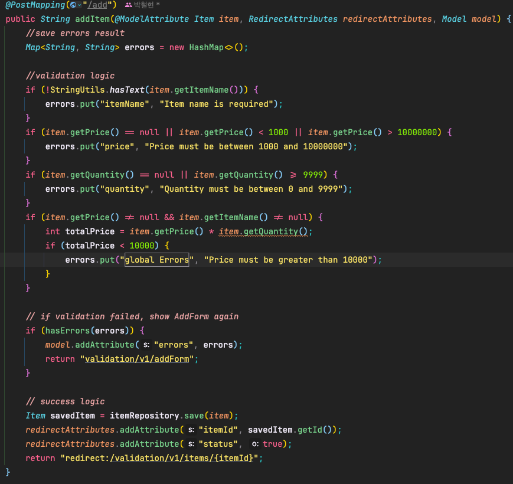

클라이언트가 상품 등록 폼에서 상품명을 입력하지 않거나, 가격 수량등의 오류 발생 시 서버 검증 로직이 실패해야되며 실패 원인과, 해결 방법을 클라이언트에게 제시해주면서, 다시 상품 등록 폼을 보여줘야한다.





**검증 오류 보관**  
`Map<String, String> errors = new HashMap<>();`
만약 검증시 오류가 발생하면 어떤 검증에서 오류가 발생했는지 정보를 담아둔다.


**StringUtils**
- Spring에서 제공하는 StringUtils.hasText 메서드는 특정 문자열이 실제 텍스트를 포함하고 있는지 (즉, 비어있지 않고, 공백만으로 구성되어 있지 않은지) 확인하는데 사용된다.

- 다시 말해,  StringUtils.hasText(item.getItemName()) 부분은 item.getItemName()가 null이 아니고, 길이가 0이 아니며, 공백 문자만으로 이루어져 있지 않을 때 true를 반환한다.
  값이 채워져 있을 경우에는 (반대의 경우에는) false를 반환한다.

```java
    if (!errors.isEmpty()) {
        model.addAttribute("errors", errors);
        return "validation/v1/addForm";
    }
```
만약 검증에서 오류 메시지가 하나라도 있으면 오류 메시지를 출력하기 위해 `model` 에 `errors` 를 담고, 입력 폼이 있 는 뷰 템플릿으로 보낸다.


```html
<div th:if="${errors?.containsKey('global Error')}">
    <p th:text="${errors['global Errors']}">전체 오류 메시지</p>
</div>
```


컨트롤러에서 Error 발생 시 errors라는 Map에 데이터를 저장해두었다.

그후 th:if를 통해 erros Map에 global Errors라는 키가 있는 경우에만 div 태그를 렌더링하라는 의미이다.
errors?.containsKey 구문은 errors가 null인지 체크하여 null이 아니면 containsKey 메서드를 호출하는 방식이다.


**참고 Safe Navigation Operator**
만약 여기에서 `errors` 가 `null` 이라면 어떻게 될까?
생각해보면 등록폼에 진입한 시점에는 `errors` 가 없다.
따라서 `errors.containsKey()` 를 호출하는 순간 `NullPointerException` 이 발생한다.
`errors?.` 은 `errors` 가 `null` 일때 `NullPointerException` 이 발생하는 대신, `null` 을 반환하는 문법 이다.
`th:if` 에서 `null` 은 실패로 처리되므로 오류 메시지가 출력되지 않는다.
이것은 스프링의 SpringEL이 제공하는 문법이다.


**정리**
- 만약 검증 오류가 발생하면 입력 폼을 다시 보여준다.
- 검증 오류들을 고객에게 친절하게 안내해서 다시 입력할 수 있게 한다. 검증 오류가 발생해도 고객이 입력한 데이터가 유지된다.

**남은 문제점**
- 뷰 템플릿에서 중복 처리가 많다. 뭔가 비슷하다.
- 타입 오류 처리가 안된다. `Item` 의 `price` , `quantity` 같은 숫자 필드는 타입이 `Integer` 이므로 문자 타입 으로 설정하는 것이 불가능하다. 숫자 타입에 문자가 들어오면 오류가 발생한다. 그런데 이러한 오류는 스프링 MVC에서 컨트롤러에 진입하기도 전에 예외가 발생하기 때문에, 컨트롤러가 호출되지도 않고, 400 예외가 발생 하면서 오류 페이지를 띄워준다.

- `Item` 의 `price` 에 문자를 입력하는 것 처럼 타입 오류가 발생해도 고객이 입력한 문자를 화면에 남겨야 한다. 만약 컨트롤러가 호출된다고 가정해도 `Item` 의 `price` 는 `Integer` 이므로 문자를 보관할 수가 없다. 결국 문 자는 바인딩이 불가능하므로 고객이 입력한 문자가 사라지게 되고, 고객은 본인이 어떤 내용을 입력해서 오류가 발생했는지 이해하기 어렵다.

- 결국 고객이 입력한 값도 어딘가에 별도로 관리가 되어야 한다.


