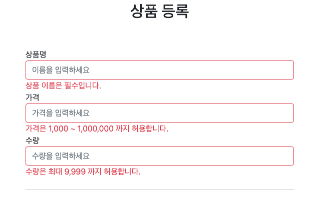

### 오류 코드와 메시지 처리

`FieldError`, `ObjectError`의 생성자는 `codes`,`argument`를 제공하는데, 이것은 오류 발생시 오류 코드로 메시지를 찾기 위해 사용된다.


**errors 메시지 파일 생성**

`messages.properties` 를 사용해도 되지만, 오류 메시지를 구분하기 쉽게 `errors.properties` 라는 별도의 파일로 관리해보자.


먼저 스프링 부트가 해당 메시지 파일을 인식할 수 있게 다음 설정을 추가한다. 이렇게하면`messages.properties` , `errors.properties` 두 파일을 모두 인식한다. (생략하면`messages.properties` 를 기본으로 인식한다.)


**스프링 부트 메시지 설정 추가**

`application.properties`
```properties
spring.messages.basename=messages,errors
```


`errors.properties`

```properties
required.item.itemName=상품 이름은 필수입니다.
range.item.price=가격은 {0} ~ {1} 까지 허용합니다.
max.item.quantity=수량은 최대 {0} 까지 허용합니다.
totalPriceMin= 가격 * 수량의 합은 {0}원 이상이어야 합니다. 현재 값 = {1}
```
여기서 errors.properties에서 설정해놓은 Key를 바탕으로 Value를 뽑아올 수 있다.

```java
if (!StringUtils.hasText(item.getItemName())) {
            bindingResult.addError(new FieldError("item","itemName",item.getItemName(),false, new String[]{"required.item.itemName"},null,null));
        }
        if (item.getPrice() == null || item.getPrice() < 1000 || item.getPrice() > 10000000) {
            bindingResult.addError(new FieldError("item","price",item.getPrice(),false, new String[]{"range.item.price"},new Object[]{1000,1000000},null));
        }
        if (item.getQuantity() == null || item.getQuantity() >= 9999) {
            bindingResult.addError(new FieldError("item","quantity", item.getQuantity(),false, new String[]{"max.item.quantity"},new Object[]{9999},null));
        }
        //Global Error
        if (item.getPrice() != null && item.getItemName() != null) {
            int totalPrice = item.getPrice( ) * item.getQuantity();
            if (totalPrice < 10000) {
                bindingResult.addError(new ObjectError("item",new String[]{"totalPriceMin"},new Object[]{10000,totalPrice},null));
            }
        }
```



**참고**: `errors_en.properties` 파일을 생성하면 오류 메시지도 국제화 처리를 할 수 있다.
